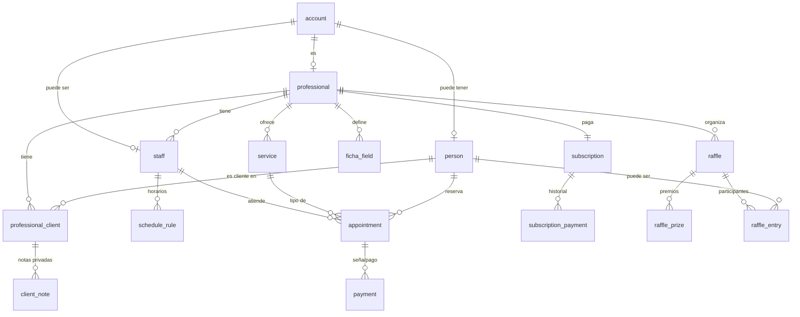

# Modelo de datos — Turnero SaaS

Documento de referencia para el repositorio. Pensado para PostgreSQL (en la VM, vía Coolify) con backend NestJS.

---

## Convenciones generales

- **PK:** `uuid` (recomendado UUID v7, ordenable por tiempo). Evita enumeración y facilita merges.
- **Timestamps:** `created_at`, `updated_at` como `timestamptz`. Todo en UTC; la zona horaria del negocio se guarda aparte para mostrar.
- **Dinero:** se guarda en **centavos** como `integer` (`amount_cents`) + `currency` (`ARS`). Nunca `float`.
- **Borrado:** se prefiere `status` o `deleted_at` (soft delete) antes que borrar, sobre todo en turnos y pagos (historial).
- **Multi-tenancy:** casi toda tabla "de negocio" lleva `professional_id`. Las consultas filtran siempre por ese campo. Se recomienda **RLS** en Postgres como defensa en profundidad, además del guard de tenant en NestJS.
- **Índices:** índices compuestos que empiecen por `professional_id` en las tablas multi-tenant.

---

## 1. Identidad y cuentas

### `account`
Entidad de autenticación. Cualquiera que pueda (o pueda llegar a) iniciar sesión.

| Campo | Tipo | Notas |
|---|---|---|
| id | uuid PK | |
| email | citext UNIQUE | case-insensitive |
| password_hash | text NULL | NULL = cuenta sin contraseña (cargada por un profesional, aún no reclamada) |
| google_id | text UNIQUE NULL | login con Google |
| email_verified_at | timestamptz NULL | |
| is_claimed | boolean | `false` mientras no tenga contraseña/Google propio |
| is_platform_admin | boolean | sos vos, el dueño |
| status | enum | `active` / `blocked` |
| created_at / updated_at | timestamptz | |

> Una cuenta **no reclamada** tiene email pero `password_hash = NULL` e `is_claimed = false`. Se reclama con un código por email (ver `verification_token`), momento en el que setea contraseña.

### `person`
Identidad **global** de un cliente (la "Persona" reutilizable entre profesionales).

| Campo | Tipo | Notas |
|---|---|---|
| id | uuid PK | |
| account_id | uuid FK → account NULL | NULL si es un cliente "suelto" sin cuenta todavía |
| full_name | text | |
| phone | text NULL | clave de matcheo/dedup |
| email | citext NULL | clave de matcheo/dedup |
| created_at / updated_at | timestamptz | |

> Matcheo para reclamar/deduplicar: por `email` o `phone`. El reclamo **siempre** se verifica con código (nunca se asigna una ficha solo porque coincide un teléfono).

### `professional`
El **tenant**: quien paga la suscripción (persona sola o negocio).

| Campo | Tipo | Notas |
|---|---|---|
| id | uuid PK | |
| account_id | uuid FK → account UNIQUE | el login del profesional |
| business_name | text | |
| slug | text UNIQUE | para la URL pública de reservas (`/r/mi-peluqueria`) |
| timezone | text | ej. `America/Argentina/Buenos_Aires` |
| default_deposit_mode | enum | `none` / `required` / `hybrid` (default para servicios nuevos) |
| cancellation_window_hours | integer | ej. 24 |
| public_page_settings | jsonb | branding: logo, colores, descripción |
| created_at / updated_at | timestamptz | |

### `staff`
Cada persona/sillón que atiende dentro de un `professional`. Para un profesional solo, se crea uno automático.

| Campo | Tipo | Notas |
|---|---|---|
| id | uuid PK | |
| professional_id | uuid FK → professional | |
| account_id | uuid FK → account NULL | NULL si el sillón no tiene login propio |
| display_name | text | |
| is_active | boolean | |
| created_at / updated_at | timestamptz | |

### `verification_token`
Códigos de un solo uso: verificar email, reclamar cuenta, reset de contraseña, OTP.

| Campo | Tipo | Notas |
|---|---|---|
| id | uuid PK | |
| account_id | uuid FK → account NULL | |
| contact | text | email o teléfono destino |
| code_hash | text | el código se guarda hasheado |
| purpose | enum | `email_verify` / `account_claim` / `password_reset` / `otp` |
| expires_at | timestamptz | |
| used_at | timestamptz NULL | |
| created_at | timestamptz | |

---

## 2. Relación profesional ↔ cliente y ficha dinámica

### `professional_client`
La **membresía**: vincula una `person` con un `professional`. Acá vive todo lo per-tenant. Es el corazón del aislamiento.

| Campo | Tipo | Notas |
|---|---|---|
| id | uuid PK | |
| professional_id | uuid FK → professional | |
| person_id | uuid FK → person | |
| ficha_values | jsonb | valores de los campos dinámicos, indexados por `ficha_field.id` |
| status | enum | `active` / `archived` |
| created_at / updated_at | timestamptz | |

> **UNIQUE(professional_id, person_id).** La ficha del profesional A para la persona X es invisible para el profesional B.

### `ficha_field`
Definiciones de los campos que cada profesional arma para sus fichas.

| Campo | Tipo | Notas |
|---|---|---|
| id | uuid PK | |
| professional_id | uuid FK → professional | |
| label | text | el nombre que le pone el profesional |
| type | enum | `text` / `number` / `date` / `select` / `boolean` / `photo` |
| options | jsonb NULL | para `select` |
| is_required | boolean | |
| is_visible_to_client | boolean | capa "ficha" (true) vs privada |
| display_order | integer | |
| created_at / updated_at | timestamptz | |

### `client_note`
Notas privadas del profesional sobre un cliente. **Nunca** visibles al cliente.

| Campo | Tipo | Notas |
|---|---|---|
| id | uuid PK | |
| professional_client_id | uuid FK → professional_client | |
| author_staff_id | uuid FK → staff NULL | |
| body | text | |
| created_at / updated_at | timestamptz | |

---

## 3. Catálogo y disponibilidad

### `service`
Catálogo de servicios. Define la duración (cómo se bloquea el calendario) y la política de seña.

| Campo | Tipo | Notas |
|---|---|---|
| id | uuid PK | |
| professional_id | uuid FK → professional | |
| name | text | |
| duration_minutes | integer | |
| price_cents | integer | |
| deposit_mode | enum | `none` / `required` / `hybrid` |
| deposit_amount_cents | integer NULL | requerido si `deposit_mode <> none` |
| is_active | boolean | |
| created_at / updated_at | timestamptz | |

### `schedule_rule`
Horarios de atención y descansos, por staff.

| Campo | Tipo | Notas |
|---|---|---|
| id | uuid PK | |
| staff_id | uuid FK → staff | |
| day_of_week | smallint | 0–6 |
| start_time | time | |
| end_time | time | |
| kind | enum | `work` / `break` |

### `time_off`
Vacaciones, feriados y bloqueos manuales.

| Campo | Tipo | Notas |
|---|---|---|
| id | uuid PK | |
| staff_id | uuid FK → staff | |
| start_at / end_at | timestamptz | |
| reason | text NULL | |

### `staff_calendar_integration` *(opcional — Google Calendar)*
| Campo | Tipo | Notas |
|---|---|---|
| id | uuid PK | |
| staff_id | uuid FK → staff | |
| provider | enum | `google` |
| access_token / refresh_token | text (cifrado) | |
| expires_at | timestamptz | |
| external_calendar_id | text | |

---

## 4. Turnos (incluye sala de espera)

### `appointment`
| Campo | Tipo | Notas |
|---|---|---|
| id | uuid PK | |
| professional_id | uuid FK → professional | para filtrado/RLS rápido |
| staff_id | uuid FK → staff | |
| person_id | uuid FK → person | el cliente (puede ser uno "suelto") |
| service_id | uuid FK → service | |
| start_at | timestamptz | |
| end_at | timestamptz | derivado de la duración, pero guardado |
| status | enum | `requested` / `confirmed` / `in_progress` / `done` / `no_show` / `cancelled` |
| is_provisional | boolean | caso híbrido: reservado sin seña, **puede ser desplazado** |
| cancellation_reason | enum NULL | `client` / `professional` / `bumped` / `no_show` |
| actual_start_at | timestamptz NULL | cuándo pasó a `in_progress` (para el ETA de la sala) |
| created_via | enum | `client_self` / `professional` |
| created_at / updated_at | timestamptz | |

**Sala de espera en vivo:** el ETA se calcula con `actual_start_at` del turno `in_progress` + las duraciones de los que están delante. Cuando el staff avanza la cola, se emite por WebSocket y todos recalculan.

**Los tres modos de seña (campo 16):**
- `none` → el turno se crea `confirmed` sin pago.
- `required` → el turno queda `requested` hasta que se registra el pago de la seña; recién ahí pasa a `confirmed`.
- `hybrid` → se permite reservar sin seña con `is_provisional = true`. Si otra persona abona la seña sobre ese mismo horario, el provisional se cancela (`cancellation_reason = bumped`), se notifica al desplazado y el nuevo turno queda `confirmed`.

> ⚠️ **Concurrencia:** la operación "pagar seña sobre un horario" debe correr en una **transacción con lock** sobre el slot, para que dos pagos simultáneos no generen doble turno. Diseñalo así desde el día uno.

---

## 5. Pagos

### `payment`
Señas y pagos de servicio (turnos). Separado de la facturación de la suscripción.

| Campo | Tipo | Notas |
|---|---|---|
| id | uuid PK | |
| professional_id | uuid FK → professional | |
| appointment_id | uuid FK → appointment NULL | |
| person_id | uuid FK → person | |
| type | enum | `deposit` / `service` |
| amount_cents | integer | |
| method | enum | `cash` / `mercadopago` |
| status | enum | `pending` / `paid` / `refunded` / `failed` |
| mercadopago_ref | text NULL | id de pago de MP |
| paid_at | timestamptz NULL | en efectivo, lo marca el profesional |
| created_at / updated_at | timestamptz | |

---

## 6. Lista de espera

### `waitlist_entry`
| Campo | Tipo | Notas |
|---|---|---|
| id | uuid PK | |
| professional_id | uuid FK → professional | |
| staff_id | uuid FK → staff NULL | |
| person_id | uuid FK → person | |
| service_id | uuid FK → service NULL | |
| desired_from / desired_to | timestamptz | rango deseado |
| status | enum | `waiting` / `notified` / `converted` / `expired` |
| created_at / updated_at | timestamptz | |

---

## 7. Suscripciones (lado dueño)

### `subscription`
| Campo | Tipo | Notas |
|---|---|---|
| id | uuid PK | |
| professional_id | uuid FK → professional UNIQUE | |
| status | enum | `trial` / `active` / `past_due` / `grace` / `blocked` / `cancelled` |
| trial_ends_at | timestamptz NULL | meses de prueba |
| current_period_start / current_period_end | timestamptz | |
| grace_ends_at | timestamptz NULL | mes de gracia |
| amount_cents | integer | ej. 1.100.000 (= 11.000 ARS) |
| mercadopago_preapproval_id | text NULL | suscripción recurrente de MP |
| created_at / updated_at | timestamptz | |

> El estado **"por vencer"** no es un estado guardado: lo dispara un job programado que mira `current_period_end` y manda el aviso. El paso `active → past_due → grace → blocked` lo maneja ese mismo job + los webhooks de MercadoPago.

### `subscription_payment`
Historial de cada cobro de suscripción.

| Campo | Tipo | Notas |
|---|---|---|
| id | uuid PK | |
| subscription_id | uuid FK → subscription | |
| amount_cents | integer | |
| status | enum | `paid` / `failed` |
| period_start / period_end | timestamptz | |
| mercadopago_ref | text NULL | |
| paid_at | timestamptz NULL | |
| created_at | timestamptz | |

---

## 8. Notificaciones

### `notification`
Cola persistida (respaldada por BullMQ/Redis para los envíos y reintentos).

| Campo | Tipo | Notas |
|---|---|---|
| id | uuid PK | |
| professional_id | uuid FK → professional NULL | |
| person_id | uuid FK → person NULL | |
| channel | enum | `email` / `whatsapp` |
| type | enum | `reminder` / `waitlist` / `bumped` / `deposit` / `subscription` |
| payload | jsonb | |
| scheduled_for | timestamptz | ej. 24 h antes del turno |
| status | enum | `queued` / `sent` / `failed` |
| attempts | integer | |
| sent_at | timestamptz NULL | |
| created_at | timestamptz | |

---

## 9. Sorteos *(fase 2, pero modelado ya por el vínculo con "reclamar cuenta")*

### `raffle`
| Campo | Tipo | Notas |
|---|---|---|
| id | uuid PK | |
| professional_id | uuid FK → professional | |
| name | text | |
| status | enum | `draft` / `running` / `finished` |
| winner_entry_id | uuid FK → raffle_entry NULL | |
| finished_at | timestamptz NULL | |
| created_at / updated_at | timestamptz | |

### `raffle_prize`
| Campo | Tipo | Notas |
|---|---|---|
| id | uuid PK | |
| raffle_id | uuid FK → raffle | |
| name | text | |
| photo_key | text NULL | objeto en MinIO |
| display_order | integer | |

### `raffle_entry`
| Campo | Tipo | Notas |
|---|---|---|
| id | uuid PK | |
| raffle_id | uuid FK → raffle | |
| person_id | uuid FK → person NULL | NULL = entrada solo por número (no registrado) |
| number | integer | |
| label | text NULL | |

> **Vínculo con reclamar cuenta:** al cargar participantes por email, se crea (o reutiliza) una `person` con una `account` no reclamada. Esa persona luego se hace dueña de su panel con un código por email. Lo mismo aplica a clientes sueltos cargados a mano.

---

## 10. Legal y seguridad

### `consent`
Para Ley 25.326: consentimiento, política de privacidad, términos.

| Campo | Tipo | Notas |
|---|---|---|
| id | uuid PK | |
| account_id | uuid FK → account | |
| type | enum | `privacy_policy` / `terms` / `data_processing` |
| version | text | versión del texto aceptado |
| accepted_at | timestamptz | |
| ip | inet NULL | |

### `audit_log`
| Campo | Tipo | Notas |
|---|---|---|
| id | uuid PK | |
| account_id | uuid FK → account NULL | quién |
| professional_id | uuid FK → professional NULL | en qué tenant |
| action | text | ej. `appointment.cancel` |
| entity / entity_id | text / uuid | sobre qué |
| metadata | jsonb | |
| ip | inet NULL | |
| created_at | timestamptz | |

---

## 11. Archivos

### `file`
Metadatos de objetos en MinIO (fotos de ficha, premios, exports).

| Campo | Tipo | Notas |
|---|---|---|
| id | uuid PK | |
| professional_id | uuid FK → professional | |
| owner_type | text | `ficha` / `prize` / `export` |
| owner_id | uuid | |
| object_key | text | clave aleatoria en MinIO (no el nombre original) |
| mime | text | validar el MIME real, no la extensión |
| size_bytes | bigint | |
| created_at | timestamptz | |

> Bucket **privado** + URLs firmadas temporales. Imágenes comprimidas con `sharp` antes de subir si superan el umbral.

---

## 12. Fase 2 (solo se mencionan)

- **`loyalty_card`** / `stamp`: tarjeta de sellos (cada N visitas, premio). Derivable de `appointment` (status `done`) o con su propia tabla de sellos.
- **Imágenes de disponibilidad compartibles:** no necesitan tabla; se generan a partir de `appointment` + `schedule_rule`.

---

## Mapa de relaciones (núcleo)

---

## Notas de implementación clave

1. **Aislamiento:** guard de tenant en NestJS que inyecta `professional_id` en cada query, **+ RLS** en Postgres como red de seguridad.
2. **Seña híbrida:** transacción con lock sobre el slot (ver §4).
3. **Reclamo de cuenta:** siempre con `verification_token`, nunca por coincidencia directa.
4. **Reminders y estados de suscripción:** jobs programados (`@nestjs/schedule`) que encolan en BullMQ.
5. **Dinero en centavos**, fechas en `timestamptz`.
